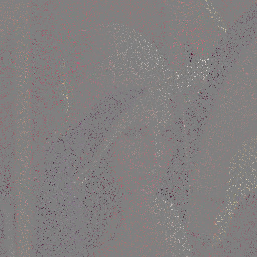
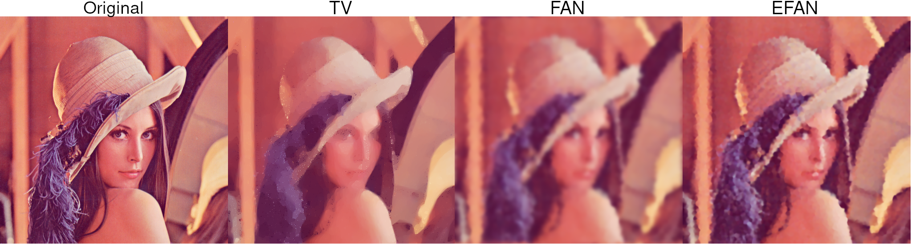

---
title: Introduction à la recherche 
subtitle: Extreme image completion
author:
- Huy-Hai Vincent NGUYEN
- Romain GILLE
date: \today
geometry: margin=1in
...

\newpage

# Synthèse de l'article

## Application de l'algorithme EFAN

L'Efficient Filtering by Adaptive Normalization (EFAN) développé par l'École
Polytechnique Fédérale de Lausanne (EPFL) en Suisse est un algorithme
d'inpainting.

L'inpainting est une technique qui permet de restaurer des parties perdues ou
détériorées d'une image ou d'une vidéo. Cependant, les techniques de
complétion d'images ne sont pas strictement réservées au domaine de la
restauration.

Elles permettent de procéder à une multitude de traitements tels que
l'agrandissement ou la réduction de la taille d'une image en conservant les
échelles, la *super-résolution*, la *réduction de bruit*, le *dématriçage*,
l'*élimination des artefacts*, et l'*édition d'image*.
Ces différentes méthodes seront décrites dans la partie suivante.

Plusieurs algorithmes d'inpainting existent déjà tels que :

* Texture synthesis based image inpainting
* Exemplar and search based image inpainting
* PDE based inpainting
* Fast semi-automatic inpainting
* Hybrid Inpainting

Le principal avantage de l'EFAN contrairement aux autres algorithmes est sa
complexité extrêmement faible. Une complexité en $O(n)$ avec $n$, le nombre de
pixels contenus dans l'image finale. La  complexité de l'algorithme est
également indépendante de l'état de détérioration de l'image.

\newpage

# Applications

## Super-résolution

Le but de la Super-résolution est d'obtenir à partir de plusieurs images,
une nouvelle image avec une résolution supérieure.
Pour cela, on prends plusieurs images et on les aligne pour obtenir une
nouvelle image avec une plus grande résolution. Cette méthode est appelée
Exemplar-based super-resolution. 

Une autre méthode appelée Single-image super-resolution a été théorisée et
publiée par l'International Conference on Computer Vision (ICCV) de 2009.
Dans ce cas, pour effectuer une super résolution, une duplication des pixels
est effectuée à partir d'une seule et même image.

\newpage

## Dématriçage

Le dématriçage, aussi appelé débayerisation est un algorithme utilisé pour
restaurer une image en couleur à partir des échantillons de couleurs incomplets
émis par un capteur d'image. 

\newpage

# Mesures de la qualité d'une image

## Mean-Squared Error (MSE)

Le Mean-Squared Error ou en français le Carré Moyen des Erreurs ou
Erreur Quadratique Moyenne calcule la différence au carré entre les pixels
d'une image A et une image B, fait la somme de ces différences et divise cette
somme par le nombre total de pixels. 
Il permet de comparer deux images et d'observer leur taux de ressemblance.
Si les deux images comparées sont identiques, le MSE vaudra alors $0$.

Le désavantage de cette métrique, est sa dépendance avec le codage des pixels
des images. Une image codée en 8 bits avec un MSE de 100 ne représentera pas la
même qualité qu'une image codée en 10 bits pour le même MSE.

$$e_{MSE} = \frac{1}{M N} \sum_{n=1}^{M} \sum_{m=1}^{N}[\hat{g}(n, m) - g(n, m)]^2$$

## Peak Signal-to-Noise Ratio (PSNR)

Le Peak Signal-to-Noise Ratio abrégé PSNR, est un autre outil pour mesurer la
qualité d'une image. Il est notamment utilisé pour comparer la qualité de la
reconstruction des codecs de compresssions avec perte.
L'intérêt du PSNR réside dans sa non dépendance avec le codage des pixels des
images contrairement au MSE.
Pour éviter cette dépendance, le PSNR pondère le MSE en fonction de l'encodage
de l'image.

$$PSNR = -10\log_{10}\frac{e_{MSE}}{S^2}$$

* $S$ est le pixel avec la plus grande valeur dans l'image
* le PSNR est une mesure en décibel (dB).
* en l'absence de bruits, ou en d'autres termes, si l'image d'origine et
    l'image comparée sont identiques, la valeur du PSNR est infinie.

## Structural SIMilarity (SSIM)

Le Structural SIMilarity, contrairement au MSE et au PSNR qui comparent les
images pixel par pixel, mesure la similarité de structure entre les deux
images.
La notion de structure est l'idée que les pixels ont une forte interdépendance
entre eux en particulier quand ils sont proches.

$$SSIM(x, y) = \frac{(2\mu_x\mu_y + c_1)(2\sigma_{xy}+ c_2)}{(\mu^2_x + \mu^2_y + c_1)(\sigma^2_x + \sigma^2_y + c_2)}$$

* $\mu_{x}$ la moyenne de x
* $\mu_{y}$ la moyenne de y
* $\sigma^2_{x}$ la variance de x
* $\sigma^2_{y}$ la variance de y
* $\sigma_{xy}$ la covariance de x et y
* $c_{1}=(k_{1}L)^2$, $c_{2}=(k_{2}L)^2$ deux variables pour stabiliser la
    division avec des faibles denominateurs
* $L$ la gamme dynamique des valeurs des pixels
    (généralement $2^{#bits par pixel} - 1) 
* $k_1=0.01$ et $k_2=0.03$ par défaut

# Étude de l'implémentation

Lors de cette étude, nous avons observés plusieurs algorithmes de complétion
d'images. Nous avons retenus pour ce rendu les algorithmes EFAN, FAN ainsi que
TV. L'algorithme basé sur Exemplar, bien qu'étudié n'a pas été retenu pour les
tests car il avait un temps d'exécution trop long.

Le but de l'expérience était de tester ces algorithmes sur la reformation d'une
image à partir de $5\%$ de ses pixels d'origine.

Nous avons, pour expérimenter ces programmes utilisé comme image originale
la Figure 3 ci-dessous.

Une fois le masque de $5\%$ de pixels appliqué sur celle-ci, nous obtenons la
Figure 4 ci-dessous.

# Expérimentations

Lors de nos expérimentations, nous avons découvert de grandes différences de
temps d'exécution et de résultat avec les différents programmes.
Nos tests ont été faits sur les trois programmes avec l'image suivante ainsi
qu'un taux de $95\%$ de pixels manquant.

## Temps d'exécution

On observe un temps d'exécution assez long de quatres secondes pour
l'utilisation du programme TV qui s'explique par un nombre de passage
élevé sur l'image.
Pour les programmes FAN et EFAN, les temps d'exécution sont en dessous de la
seconde de traitement. En effet, le programme FAN exécute la tâche en quinze
centièmes de secondes ce qui semble impressionnant vue les quatres secondes
du précédent programme. Cependant, le programme EFAN le surpasse largement en
effectuant l'algorithme en trois centièmes de secondes.

## Rendu de la complétion

Pour ce qui est du rendu visuel, on voit une nette différence entre les trois
résultats. Nous pouvons observer que le temps de traitement des différents
programmes n'impacte pas la qualité visuelle finale. Sur le résultat de TV,
les traits sont grossiers. Les couleurs sont globalements présentes mais il y a
une perte importante de données de l'image.
FAN offre un résultat plus détaillé, on perçoit mieux les traits du visage.
Néanmoins, une impression de flou persiste et retire nombre de détails tels que
les plis du chapeau.
Pour finir, EFAN est le programme qui offre le rendu le plus intéressant, tous
les détails ne sont pas présents mais les traits du visages sont bien présents.

## Taille des fichiers finaux

Finalement, de même que le temps, la taille des fichiers de sortie des
programmes ne révèlent pas spécialement la qualité finale du rendu visuel.
Avec les mêmes caractéristiques que précédemment, nous avons obtenu des tailles
de 769Kb pour TV, 188Kb pour FAN et 254Kb pour EFAN.

\newpage

# Sources 

[Review of Different Inpainting Algorithms - International Journal of Computer Applications, Décembre 2012](http://citeseerx.ist.psu.edu/viewdoc/download?doi=10.1.1.303.5459&rep=rep1&type=pdf)   
[What is the difference between image super resolution and image scaling - Quora, 18 Décembre 2014](https://www.quora.com/What-is-the-difference-between-image-superresolution-and-image-scaling)   
[Demosaicing](https://ngi-user-guide.readthedocs.io/en/latest/demosaicing/)   
[Measures of image quality -  Todd Veldhuizen, 16 Janvier 1998](http://homepages.inf.ed.ac.uk/rbf/CVonline/LOCAL_COPIES/VELDHUIZEN/node18.html)   
[Mean squared error - Wikipedia](https://en.wikipedia.org/wiki/Mean_squared_error)   
[Peak signal-to-noise ratio - Wikipedia](https://en.wikipedia.org/wiki/Peak_signal-to-noise_ratio)   
[Structural Similarity - Wikipedia](https://en.wikipedia.org/wiki/Structural_similarity)   
